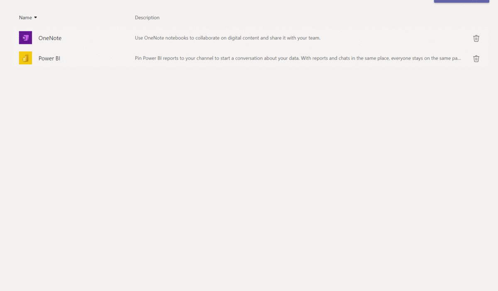
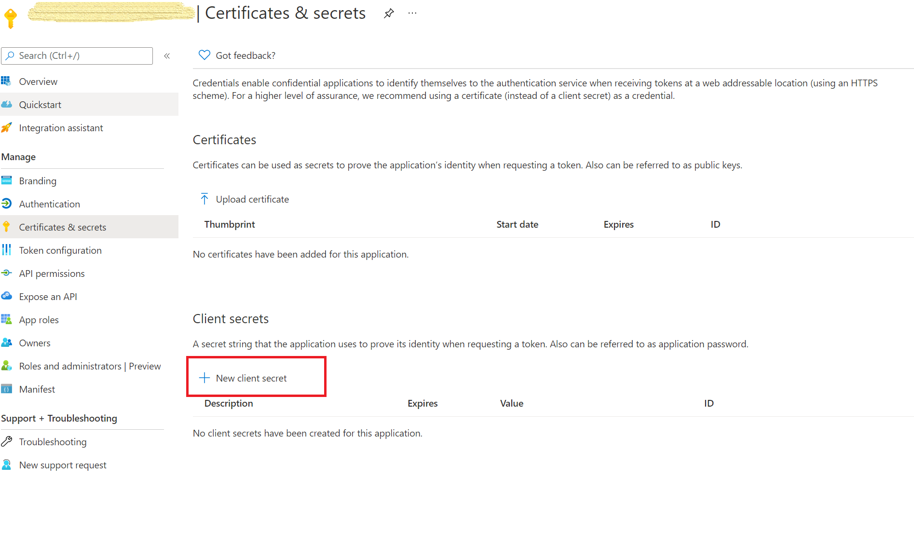
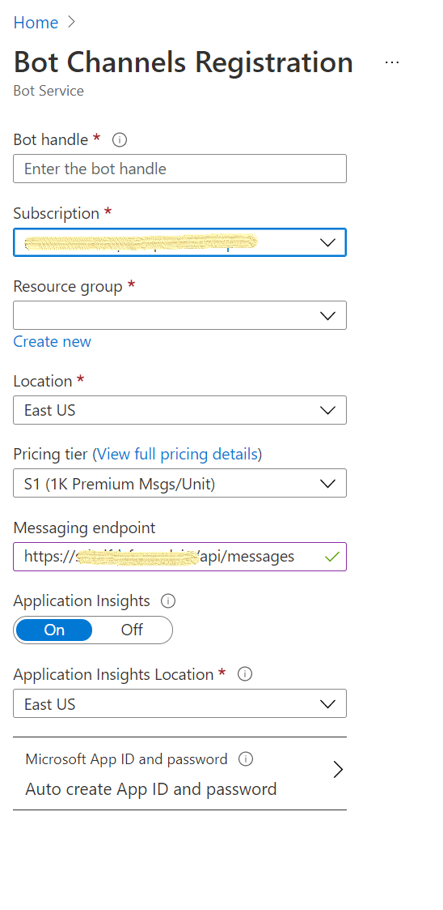
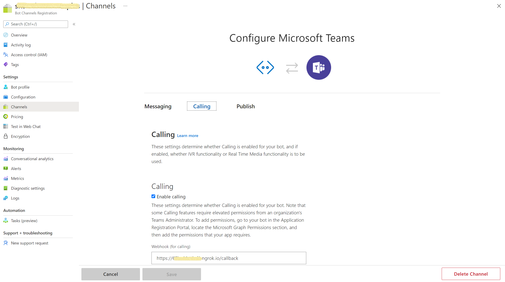
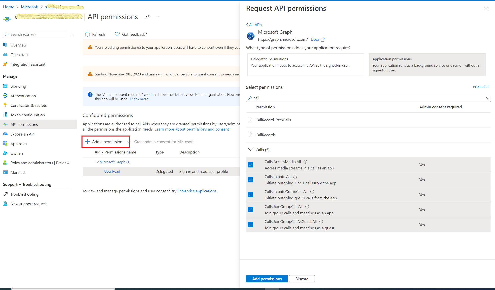
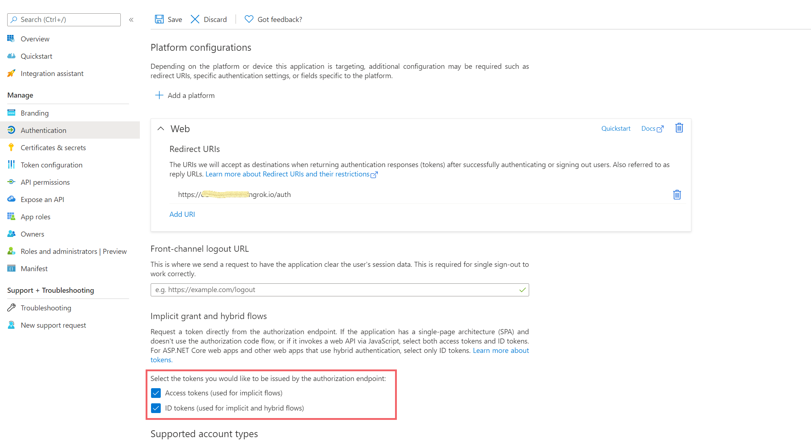
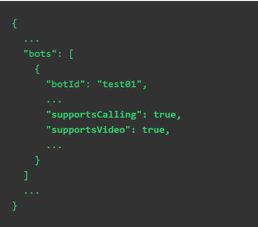
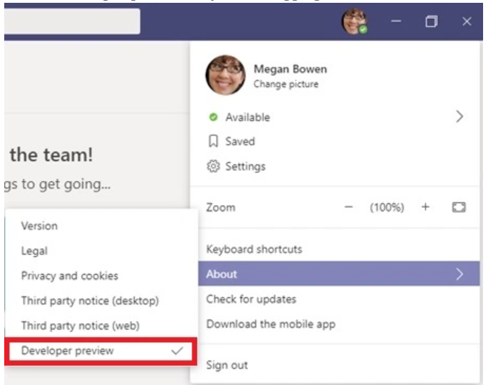
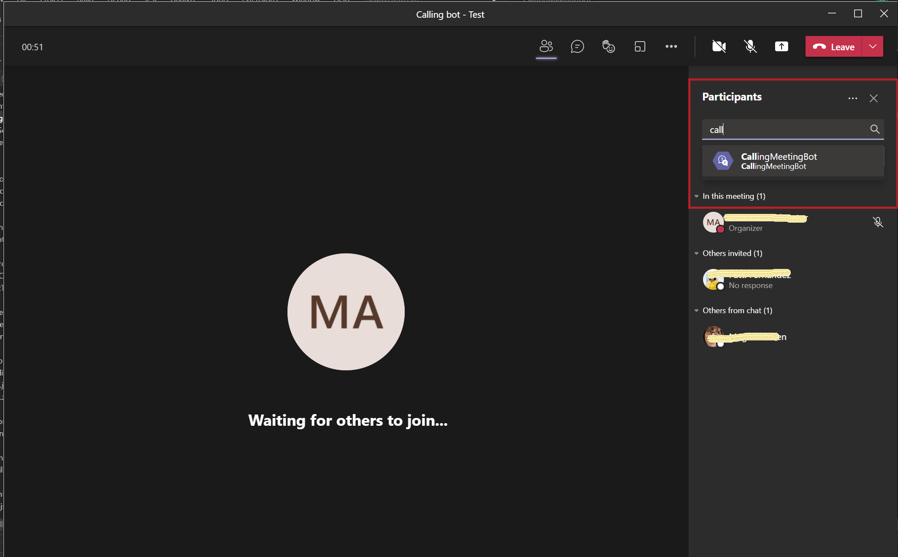

# Track participants in the call by adding Bot to Teams Meeting

## Summary
This sample code shows how to track participants in the call by adding a Calling & Meeting bot. 
Samples are generally not production-ready or an out-of-the-box solution but are intended to show developers specific patterns for use in their applications. The functionality is bare bone, all it does is tracks participants in the call once the bot is added to the meeting. 

## Prerequisites
- To test locally, you need [Ngrok](https://ngrok.com/download) installed on your local machine. Make sure you've downloaded and installed both on your local machine. ngrok will tunnel requests from the Internet to your local computer and terminate the SSL connection from Teams. 
`ex: https://%subdomain%.ngrok.io` 

## Setup Guide

### Step #1: Create AAD App
- Go to Azure Active Directory -> App registrations -> New registration.
- Register an app.
	- Provide app Name and choose Multitenant. Leave the redirect URI for now. 
	
	- Create Client Secret 
	 
	- Note the Application (Client) Id and Client Serect for further steps.

### Step #2: Register in Bot Service
- Create a Bot Channel Registration in Azure in different tab. Auto create App ID and password 
 
- Create new Microsoft App Id and password. 
 
Fill Microsoft App Id and Password as values of Application Id and Client Secret from Step #1.
- Set calling configuration in Teams channel. Add webhook for calling. `ex. https://%subdomain%.ngrok.io` 

### Step #3: Configure AAD App 
Configure the AAD app created in Step #1. 
- Add necessary API permissions to the app. 
Go to API permissions -> Add a permission -> Microsoft Graph

	- Add following Application permissions for Call
		- Calls.AccessMedia.All
		- Calls.Initiate.All
		- Calls.InitiateGroupCalls.All
		- Calls.JoinGroupCalls.All
		- Calls.JoinGroupCallsasGuest.All
	- Add following Application permissions for User
		- User.Read.All
		- User.ReadWrite.All
		- Directory.Read.All
		- Directory.ReadWrite.All
	- Add following Delegated permissions for User
		- User.Read
		- User.ReadWrite
		- User.ReadBasic.All
		- User.Read.All
		- User.ReadWrite.All
		- Directory.Read.All
		- Directory.ReadWrite.All
		- Directory.AccessAsUser.All
- Add Redirect URI
	- Select Add a platform -> web
	- Enter the redirect URI for your app `ex. https://%subdomain%.ngrok.io/`
	- Next, Enable implicit grant by checking ID Token and Access Token
 
- Consent the permissions
    - Go to "https://login.microsoftonline.com/common/adminconsent?client_id=<app_id>&state=<any_number>&redirect_uri=<app_redirect_url>"
    - Sign in with a tenant admin
    - Consent for the whole tenant.

### Step #4: Run the app locally
- Clone the repo  
`git@github.com:shsarda/callingbot-sample.git`

- If you are using Visual Studio
	- Launch Visual Studio
	- File -> Open -> Project/Solution
	- Open callingbot-sample -> CallingMeetingBot.sln

- Edit appsettings.json file
	- Update AppId and AppSecret as values of Application Id and Client Secret from Step #1.
	- Update BotBaseURL `ex. https://%subdomain%.ngrok.io`

- Run ngrok using the port on which the project is running locally.

### Step #5: Packaging and installing your app to Teams

Generate manifest by enabling "supportsCalling"
- Add two additional settings supportsCalling and supportsVideo (already enabled in manifest for this sample)
 

Make sure the required values (such as App id) are populated in the manifest, Zip the manifest with the profile images and install it in Teams.

### Step #6: Try out the app

- Enable developer preview in your debugging Teams client.

- Start the meeting and call the bot from meeting.
